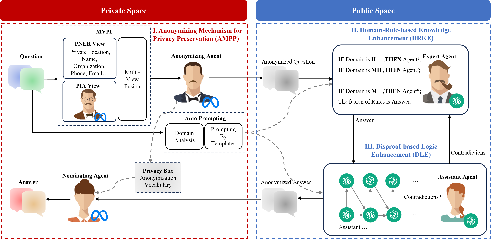
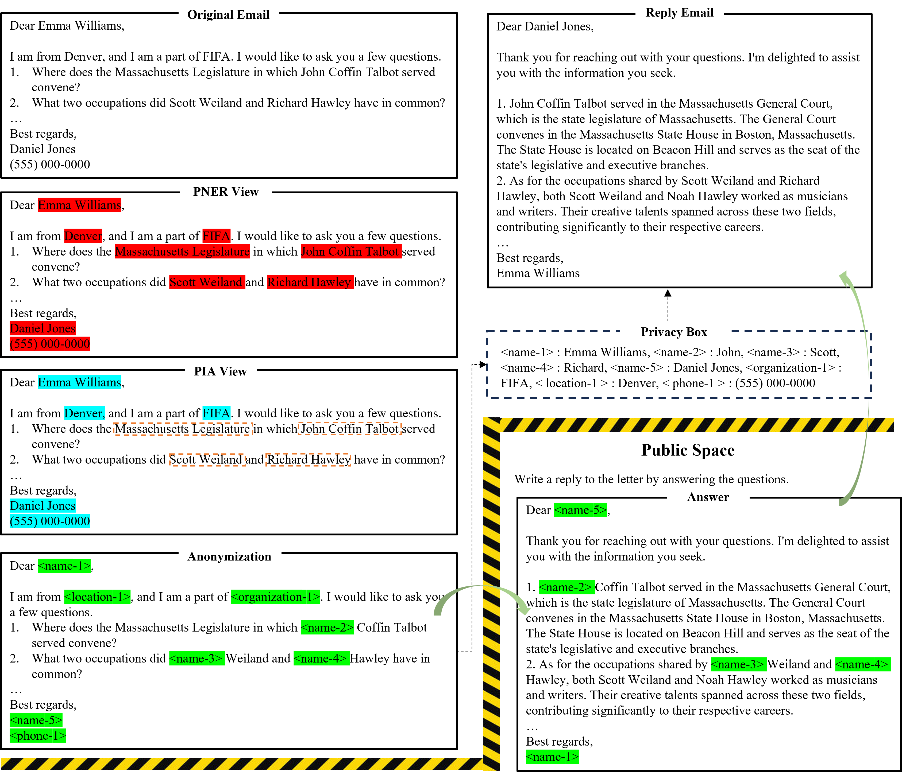
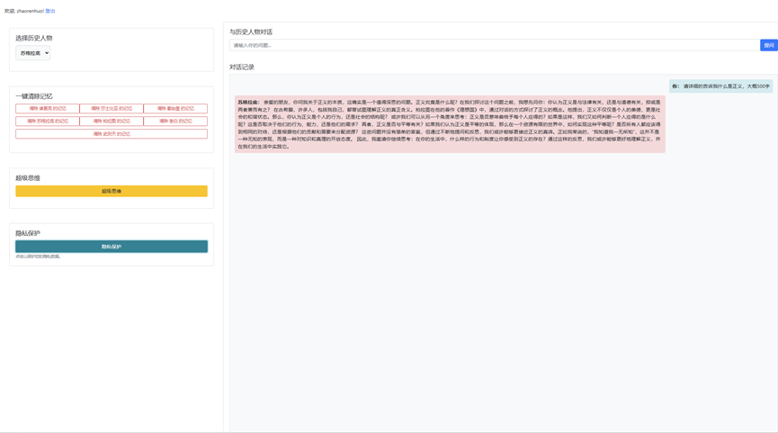

<h1 align="center">
GAMA: A General Anonymizing Multi-Agent System for Privacy Preservation Enhanced by Domain Rules and Disproof Method
</h1>
<p align="center">


</p>

<p align="center">
 <br>
<b>Figure 1</b>: The structure of the proposed framework (GAMA).
</p>


## Case Study: Email Processing

<p align="center">
 <br>
<b>Figure 3</b>: GAMA for Email Processing.
</p>

> To further evaluate GAMA, we employed it in the email processing. As illustrated in Figure 3, GAMA is required to reply to an email, yet the original message contains private information such as names, phone numbers, organizations, and so on. GAMA initially identifies the private data in the email through the PNER view and PIA view. The primary distinction between the two views is the presence of four named entities: Massachusetts Legislature, John Coffin Talbot, Scott Weiland, and Richard Hawley. The first is a well-known parliamentary organization, while the last three are famous politicians and singer-songwriters. Based on the named entity classification, PNER determines that these are private data. Conversely, PIA owns the common sense of human society, and deems them to be public and non-privacy. Following the fusion of the two views, GAMA also anonymizes the names of famous individuals randomly in order to safeguard contextual privacy. Furthermore, the anonymizing agent employed creates a privacy box for the purpose of mapping placeholders and privacy-named entities. In the public space, GAMA incorporates logic enhancement and knowledge augmentation. For knowledge enhancement, GAMA's DRKE leverages domain rules from the political and artistic fields to extract and complete knowledge about political figures and creative musicians, including their names and experiences, from emails. On the logic enhancement side, GAMA's DLE employs a Disproof approach for logical reasoning. For instance, in the second question, it progressively narrows down the location of the Massachusetts legislature, first General Court, second Boston and final Beacon Hill. In the public space, GAMA generates the reply email with placeholders. In the private space, the placeholders are then restored by the nomination agent in the private space based on the privacy box. And as the figure shown, the final reply email is present without any ammonized placeholders. The case study is further evidence that GAMA's AMPP mechanism is effective in identifying privacy, anonymizing it, and finally safeguarding the privacy in the original text.

## Environment Setup

### 1. Create a Conda Environment

```bash
conda create -n gama python=3.8
conda activate gama
```
### 2. Configure Conda Channels (conda-forge and pytorch)

It is recommended to add `conda-forge` and `pytorch` channels first to ensure compatibility between dependencies:

```bash
conda config --add channels conda-forge
conda config --add channels pytorch
conda config --set channel_priority strict
```
### 3. Install Base Conda Packages

```bash
conda install \
  libgcc-ng=14.1.0 \
  libstdcxx-ng=14.1.0 \
  _libgcc_mutex=0.1 \
  _openmp_mutex=4.5 \
  blas=1.0 \
  intel-openmp=2023.1.0 \
  cudatoolkit=11.7 \
  pytorch=2.0.0 \
  torchaudio=2.0.0 \
  torchvision=0.15.0 \
  numpy \
  pandas \
  scipy \
  matplotlib \
  scikit-learn \
  fsspec \
  openpyxl \
  h5py \
  click \
  jinja2 \
  tqdm \
  cython \
  numba \
  pillow \
  seaborn \
  yaml

```
> **Note**: Some packages such as `pytorch`, `torchaudio`, and `torchvision` are preconfigured with CUDA version 11.7.  
> If you require compatibility with other drivers or hardware, please adjust the versions accordingly or consider using CPU-only versions.

### 4. Install PyPI Packages

Some dependencies are not available through Conda and must be installed using `pip`:

```bash
pip install \
  accelerate==1.0.1 \
  aiohttp \
  aiosignal \
  celery==5.4.0 \
  transformers==4.38.2 \
  huggingface-hub \
  datasets==3.1.0 \
  fastapi==0.115.12 \
  uvicorn \
  flask \
  flask-babel \
  openai \
  paddlenlp \
  paddlepaddle-gpu==2.5.1 \
  paddlespeech \
  prettytable \
  scikit-learn \
  sentencepiece \
  sacrebleu \
  librosa \
  webrtcvad \
  loguru \
  erniebot \
  protobuf \
  soundfile \
  aiofiles \
  async-timeout \
  pydub \
  jieba \
  pypinyin \
  gensim \
  nltk \
  spacy \
  ftfy \
  pyworld

```
If you need to change the PyPI mirror (e.g., to use the Tsinghua mirror in China):

```bash
pip config set global.index-url https://pypi.tuna.tsinghua.edu.cn/simple
```
### 5. Optional Components and Debugging Tools

```bash
pip install \
  ipython \
  jupyterlab \
  rich \
  typer \
  pytest \
  black \
  isort

```
## Demo: Test the Non-Privacy Module (Domain Rules and Disproof Method)

To test the reasoning module without privacy processing, you can use the following code:

```python
import asyncio
from src.Agents.start_Q import QuestionProcessor
from src.Agents.memory import config_w2v

# Initialize the word2vec calculator
config_w2v.initialize_calculator()

async def main():
    question = ""
    processor = QuestionProcessor()
    line_number = None
    plan_answer, answers, final_answer = await processor.process_question(question, line_number)

# Run the asynchronous task
asyncio.run(main())
```
## Demo: Test the Privacy-Preserving Module in GAMA

To test the privacy-related functionality in GAMA, you can use the following code:

```python
import asyncio
from src.Agents.privacy_part import privacy_part  # Replace with your module path or use as is

# Example input
question_text = "Hi, my name is Alice. You can reach me at alice@example.com or (123) 456-7890. I work for OpenAI."

# Run the async function
async def run_demo():
    encrypted_text, replacement_dict, masked_question = await privacy_part(question_text)
    print("\nFinal Result:")
    print("Encrypted Text:", encrypted_text)
    print("Replacement Dictionary:", replacement_dict)
    print("Masked Question (with placeholders):", masked_question)

# Entry point
if __name__ == "__main__":
    asyncio.run(run_demo())


```
## Dataset Access

### Access to Public Question-answering Datasets

**Trivia Creative Writing**  
- [Link](https://github.com/MikeWangWZHL/Solo-Performance-Prompting/tree/main/data/trivia_creative_writing)  
- or contact via email: `zhaorenhuo@gmail.com`

> The task tests LLM's ability to retrieve and integrate diverse in-formation from their internal knowledge. In this task, a model must craft a coherent story around a given topic while incorporating answers to N trivia questions. We evaluate the models with N set to 5 and 10, where a higher N requires more extensive domain knowledge. Our benchmark includes 100 instances for each N, totaling 1,000 trivia questions.

**Logic Grid Puzzle**  
- [Link](https://github.com/MikeWangWZHL/Solo-Performance-Prompting/tree/main/data/logic_grid_puzzle)  
- or contact via email: `zhaorenhuo@gmail.com`

> The task is from the Bigbench dataset (Srivastava et al., 2023), which comprises 200 instances. Each instance describes a logic puzzle involving 2 to 5 houses, each occupied by a person with specific characteristics, such as playing the piano. The goal is to answer questions about house numbers based on given clues, re-quiring multi-step reasoning and the selection of relevant information. For evaluation, we measure the accuracy of the predicted house numbers by comparing them to the ground truth targets provided by the dataset.

### Access to Privacy-Preserving Datasets

**KPP and LPP**  
- Available via Hugging Face (not yet publicly released)  
- or contact via email: `zhaorenhuo@gmail.com`

**Knowledge Privacy Preservation (KPP)**

> We designed KPP for the knowledge-typed task with private data. We utilize KPP to evaluate the ability of processing the tasks under privacy preservation. First, the models for evaluation must identify and anonymize private data embedded in questions. Subsequently, the models answer 5 knowledge-typed questions inspired by HotpotQA, crafting coherent responses in the form of stories or letters. KPP includes 100 instances, each with 5 questions, totaling 500 knowledge-typed questions. 

**Logic Privacy Preservation (LPP)**

> We designed LPP for evaluates the ability of processing de-identified text and performing logical reasoning. The models for evaluation identify and anonymize private data embedded in paragraphs and questions. The anonymized questions are answered by the models. The Boolean logical reasoning questions of LPP are derived from BoolQ. Each instance involves True/False questions based on paragraph content. And each question requires logical inference and text comprehension. LPP includes 150 instances with Boolean questions. 

## Acknowledge

### Named Entity Recognition (NER) Model

We use a pretrained BERT-based NER model (`dslim/bert-large-NER`) to identify entities in text:
For more details, please refer to the [hugging face](https://huggingface.co/dslim/bert-large-NER)
```python
from transformers import AutoTokenizer, AutoModelForTokenClassification
from transformers import pipeline

# Load the tokenizer and model
tokenizer = AutoTokenizer.from_pretrained("dslim/bert-large-NER")
model = AutoModelForTokenClassification.from_pretrained("dslim/bert-large-NER")

# Create an NER pipeline
nlp = pipeline("ner", model=model, tokenizer=tokenizer)

# Example input
example = "My name is Wolfgang and I live in Berlin"

# Perform NER
ner_results = nlp(example)
print(ner_results)

```

### Word2Vec Embedding Model

We use the `word2vec-google-news-300` model from Gensim to obtain word embeddings and perform vector-based semantic analysis:
For more details, please refer to the [hugging face](https://huggingface.co/fse/word2vec-google-news-300)

```python
import gensim.downloader as api

# Download and load the model (approximately 1.5GB; downloaded on first use)
model = api.load("word2vec-google-news-300")

# Get the vector representation of a word
vector = model['king']
print(vector.shape)  # Output: (300,)

# Compute similarity between two words
similarity = model.similarity('king', 'queen')
print(f"Similarity between 'king' and 'queen': {similarity:.4f}")

# Find the most similar words based on vector arithmetic
similar_words = model.most_similar(positive=['king', 'woman'], negative=['man'], topn=5)
for word, score in similar_words:
    print(f"{word}: {score:.4f}")

```


### We Used the LLaMA3-8B Model
For more details, please refer to the [hugging face](https://huggingface.co/nvidia/Llama3-ChatQA-1.5-8B)
```python
from transformers import AutoTokenizer, AutoModelForCausalLM
import torch

model_id = "nvidia/Llama3-ChatQA-1.5-8B"

tokenizer = AutoTokenizer.from_pretrained(model_id)
model = AutoModelForCausalLM.from_pretrained(model_id, torch_dtype=torch.float16, device_map="auto")

messages = [
    {"role": "user", "content": "what is the percentage change of the net income from Q4 FY23 to Q4 FY24?"}
]

document = """NVIDIA (NASDAQ: NVDA) today reported revenue for the fourth quarter ended January 28, 2024, of $22.1 billion, up 22% from the previous quarter and up 265% from a year ago.\nFor the quarter, GAAP earnings per diluted share was $4.93, up 33% from the previous quarter and up 765% from a year ago. Non-GAAP earnings per diluted share was $5.16, up 28% from the previous quarter and up 486% from a year ago.\nQ4 Fiscal 2024 Summary\nGAAP\n| $ in millions, except earnings per share | Q4 FY24 | Q3 FY24 | Q4 FY23 | Q/Q | Y/Y |\n| Revenue | $22,103 | $18,120 | $6,051 | Up 22% | Up 265% |\n| Gross margin | 76.0% | 74.0% | 63.3% | Up 2.0 pts | Up 12.7 pts |\n| Operating expenses | $3,176 | $2,983 | $2,576 | Up 6% | Up 23% |\n| Operating income | $13,615 | $10,417 | $1,257 | Up 31% | Up 983% |\n| Net income | $12,285 | $9,243 | $1,414 | Up 33% | Up 769% |\n| Diluted earnings per share | $4.93 | $3.71 | $0.57 | Up 33% | Up 765% |"""

def get_formatted_input(messages, context):
    system = "System: This is a chat between a user and an artificial intelligence assistant. The assistant gives helpful, detailed, and polite answers to the user's questions based on the context. The assistant should also indicate when the answer cannot be found in the context."
    instruction = "Please give a full and complete answer for the question."

    for item in messages:
        if item['role'] == "user":
            # only apply this instruction for the first user turn
            item['content'] = instruction + " " + item['content']
            break

    conversation = '\n\n'.join(
        ["User: " + item["content"] if item["role"] == "user" else "Assistant: " + item["content"] for item in messages]
    ) + "\n\nAssistant:"
    formatted_input = system + "\n\n" + context + "\n\n" + conversation
    
    return formatted_input

formatted_input = get_formatted_input(messages, document)
tokenized_prompt = tokenizer(tokenizer.bos_token + formatted_input, return_tensors="pt").to(model.device)

terminators = [
    tokenizer.eos_token_id,
    tokenizer.convert_tokens_to_ids("<|eot_id|>")
]

outputs = model.generate(
    input_ids=tokenized_prompt.input_ids,
    attention_mask=tokenized_prompt.attention_mask,
    max_new_tokens=128,
    eos_token_id=terminators
)

response = outputs[0][tokenized_prompt.input_ids.shape[-1]:]
print(tokenizer.decode(response, skip_special_tokens=True))

```

### We Used GPT-4o

For more details, please refer to the [OpenAI website](https://openai.com/api/).

### We Evaluated the LLaMA-70B Model

For details, please refer to the [Ollama website](https://ollama.com/).

## Visualization Interface  
We built a Django-based visualization interface for GAMA, featuring historical dialogue interactions. Users can engage with our "Super Thinking" reasoning engine through this interface.  
> ⚠️ The privacy-preserving in Visualization Interface is coming...

<p align="center">
 <br>
<b>Figure 2</b>: GAMA Visual UI.
</p>


